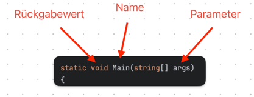

1. Funktionen erlauben uns Code auszulagern.

2. Sie machen den Code wesentlich übersichtlicher.

3. Man kann sie im Code mehrmals verwenden, ohne jedes Mal den Code wieder stark verlängern zu müssen.

