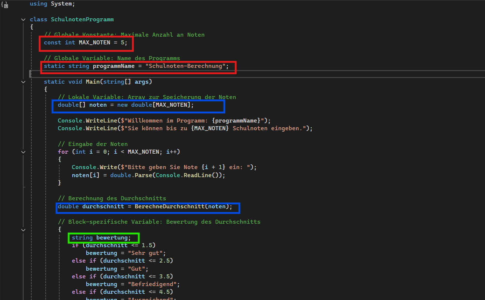

Variablen und Konstanten werden genutzt, um Daten zwischenzuspeichern. Variablen werden meistens für kurzzeitige Zwischenspeicherung, z. B. von eingelesenen Werten genutzt. Konstanten werden von Entwicklern benutzt, wenn beispielsweise ein Wert oft im Code verwendet wird. Dann erstellen sie für diesen Wert eine Konstante, anstatt jedes Mal den Wert anzugeben. Dies hat den Vorteil, dass bei einer Änderung nur die Konstante geändert werden muss und man nicht überall im Code jedes Mal den Wert ändern muss.

Gültigkeitsbereiche:

Im Code Beispiel /HZ4_4/Program.cs sind Variablen und Konstanten mit verschiedenen Gültigkeitsbereichen zu sehen. In dem Screenshot, den ich von diesem Codebeispiel gemacht habe, habe ich in verschiedenen Farben diese Gültigkeitsbereiche markiert. Jede Variable oder Konstante, die in einer eigenen Farbe ist, hat einen anderen Gültigkeitsbereich.
