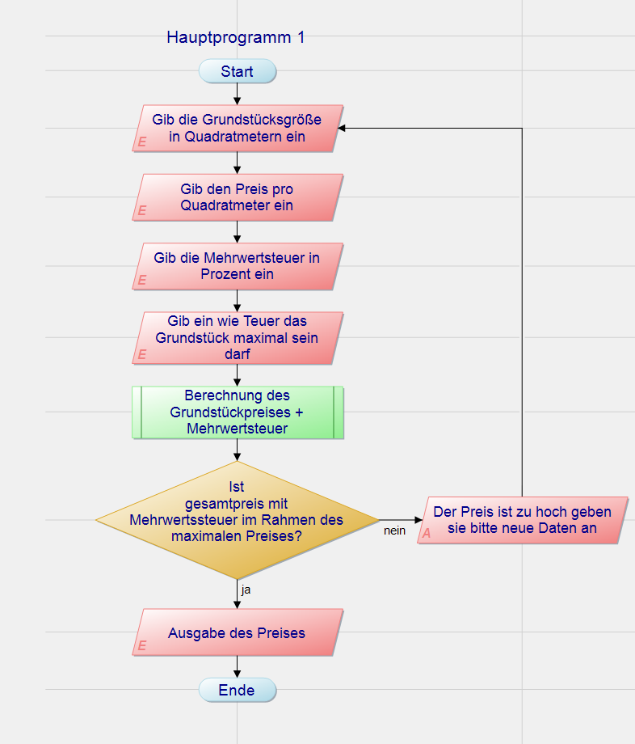
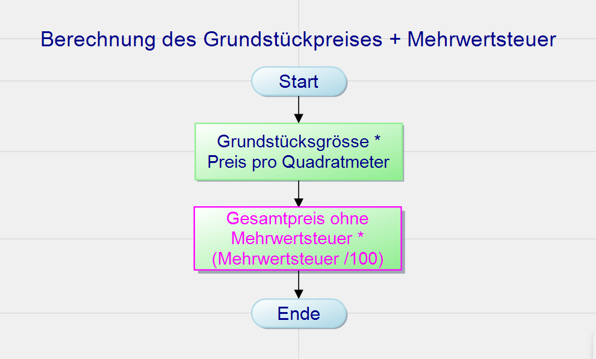

## Programm Ablauf Plan

Ein Auftraggeber will ein Programm womit er schnell und einfach ermitteln kann ob sich ein Grundstück im Preislich passenden Rahmen befindet.

| Anf.-Nr. | Typ           | Anforderung                                                                         |
|----------|---------------|-------------------------------------------------------------------------------------|
| 1        | Funktional    | Man soll einen beliebigen Preis angeben können.                                     |
| 2        | Funktional    | Man soll eine beliebige Größe angeben können.                                       |
| 3        | Funktional    | Man soll einen beliebigen Maximalpreis angeben können.                              |
| 4        | Funktional    | Der Wert des gesamten Grundstücks soll berechnet werden, inklusive Mehrwertsteuer.  |
| 5        | Funktional    | Es soll geprüft werden, ob der Gesamtpreis mit Mehrwertsteuer im Rahmen des Maximalpreises liegt. |
| 6        | Qualität      | Sollte der Preis nicht übereinstimmen, soll dies angezeigt werden und das Programm soll von vorne beginnen. |
| 7        | Randbedingung | Das Programm soll am 05.11.2024 fertig sein.                                        |
| 8        | Randbedingung | Das Programm soll in C# geschrieben sein.                                           |

